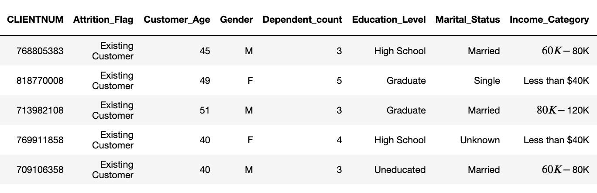

# Predict Customer Churn

- Project **Predict Customer Churn** of ML DevOps Engineer Nanodegree Udacity

## Project Description
This project is to identify credit card customers that are most likely to churn. 
The project includes a Python package for a machine learning project 
that follows coding (PEP8) and engineering best practices for implementing software 
(modular, documented, and tested). The package has the flexibility of 
being run interactively or from the command-line interface (CLI).

The dataset for this project was pulled from Kaggle:
https://www.kaggle.com/datasets/sakshigoyal7/credit-card-customers/code

Below are the first few rows associated with the dataset:


## Files in the Repo
```
.
├── data/
│   └── bank_data.csv
├── images/
│   ├── eda/
│   │   ├── churn_distribution.png
│   │   ├── customer_age_distribution.png
│   │   ├── heatmap.png 
│   │   ├── marital_status_distribution.png
│   │   └── total_transaction_distribution.png
│   └── results/
│       ├── feature_importance.png
│       ├── logistics_results.png
│       ├── rf_results.png
│       └── roc_curve_result.png
├── logs/
│   └── churn_library.log
├── models/
│   ├── logistic_model.pkl
│   └── rfc_model.pkl
├── churn_library.py
├── churn_notebook.ipynb
├── churn_script_logging_and_tests.py
├── constants.py
├── README.md
├── requirements.txt
└── sequencediagram.jpeg
```

### Major folders
**/data**: store data file in **.csv** format  

**/images**: store visualization results of Exploratory Data Analysis (EDA) and evaluation of model training  

**/logs** : store log file of the unit tests  

**/models** : store trained model in **.pkl** format  

### Files
**README.md** :　This file provides an overview of the project, the instructions to use the code.  

**churn_library.py** : A library of functions to find customers who are likely to churn. Functions include:  

    - EDA
    - Feature Engineering (including encoding of categorical variables)
    - Model Training
    - Prediction
    - Model Evaluation

Running *churn_library.py* would complete the whole data science solution process for predicting customer churn.  
For a better understanding of the function call, see the Sequence diagram *sequencediagram.jpeg* in the repository.

**churn_script_logging_and_tests.py** : This file contains unit tests for the *churn_library.py* functions. 

**constants.py** : This file stores the constants for both *churn_library.py* and *churn_script_logging_and_tests.py*.

**churn_notebook.ipynb** : A jupyter notebook contains the prototype solution to identify credit card customers that are most likely to churn.

**requirements.txt** : This file lists the dependencies and libraries for simple installation.

## Installation
1. clone the repository to your environment
   
2. install dependencies  
```bash
pip install -r requirements.txt
```

## Running Files
To run the library
```bash
python churn_library.py
```  

- The Exploratory Data Analysis (EDA) results will be saved at **/images/eda**.  
- The training evaluation results will be saved at **/images/results**.  
- The trained models will be saved at **/models**.

To run unit tests for *churn_library.py*
```bash
python churn_script_logging_and_tests.py
```
The log file of the unit tests will be saved at **/log**.